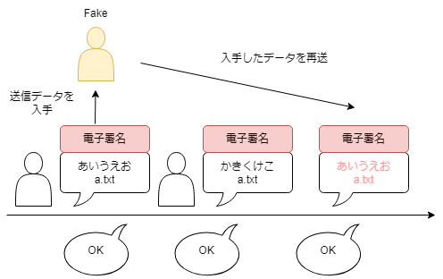
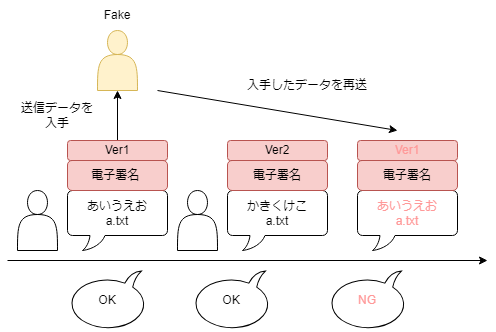

# なぜsuteraは冪等性を維持する必要があるのか
## 概要
Suteraでは個人を認証する方法として電子署名を使用します。  
しかし、冪等性を保たなければ他人を偽装した操作(リプレイ攻撃など)の危険性があります。  
そのため電子署名にバージョン情報を追加することで冪等性を保っています。

## 冪等性とは
情報工学において冪等性(べきとうせい、英: idempotence)とは、ある操作を一度行っても複数回行っても同じ結果となることです。
特に何回実行しても結果や応答が変わらない操作を指します。[1]  
冪等の例として絶対値関数があります。絶対値関数をある値に複数回適用しても返り値は変わらないためこの関数は冪等であるといえます。
## 冪等性がない場合
Suteraで冪等性が維持されない場合の例としてリプレイ攻撃があります。リプレイ攻撃とは標的が送信した情報を入手し、その情報を再送信することで不正なアクセスを実現する攻撃手法です。[2]  
以下の図が冪等性がない場合の例です。この場合では最初にある人物Aが電子署名を付加したファイルを送信し、その後にAがそのファイルを更新して再び送信したと仮定します。
ここで一番最初に送信したデータを悪意ある第三者が入手して、それを再送します。この場合、第三者が送信したファイルに付加されている電子署名は正常なものなのでサーバ側はこの更新を正常なものとして処理します。  
このように、電子署名だけでは同じファイルの送信を複数回行っても正常に処理してしまうため冪等性がないと言えます。  

## 冪等性がある場合
冪等性がある場合の例が以下の図です。Suteraでは冪等性を保つために電子署名にバージョン情報を追加しています。  
この例では先程の例と同様にある人物Aが電子署名を付加したファイルを送信、その後更新しています。そのため、悪意のある第三者からリプレイ攻撃を行われていてもバージョン情報の整合性が取れず、サーバでの処理が拒否されます。  
このように、電子署名にバージョン情報を追加すると同じファイルを複数回送信しても処理されないため冪等性が保たれていると言えます。  

## 参考文献
[1]冪等性,デジタル大辞泉,ジャパンナレッジ,閲覧2024-07-13,https://japanknowledge.com/library/  
[2]リプレイ攻撃、SOMPO CYBER SECURITY　サイバーセキュリティ用語集,閲覧2024-07-15,  https://www.sompocybersecurity.com/column/glossary/replay-attack 